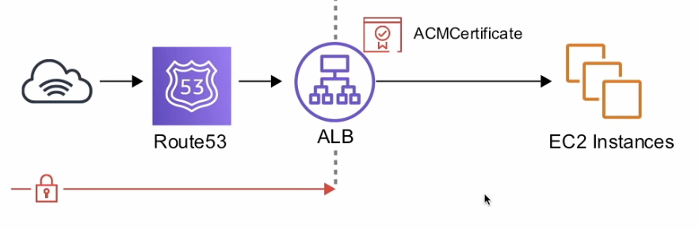
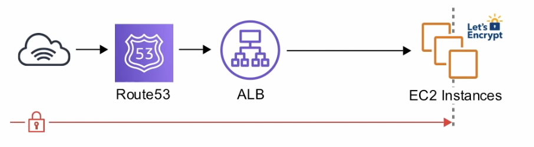

# Amazon Certificate Manager (ACM)

[Lesson link](https://youtu.be/RrKRN9zRBWs?t=12323)\
ACM handles the complexity of creating and managing public SSL/TLS certificates for your AWS based websites and applications.

ACM handles two kinds of certificates

1. Public - certificates provided by ACM (Free)
2. Private - certificates you import (**$400 / month**)

ACM can handle multiple subdomains and wilcard domains(*)
EX: `exampro.co`, `*.exampro.co`

ACM can be attached to the following AWS resources:

- ELB
- CloudFront
- API Gateway
- EB (Through ELB)

## ACM Example

- **Terminating SSL at the Load Balancer**:
  - All traffic in-transit beyond the Application Load Balancer (ALB) is not encrypted.
  - You can add as many EC2 instances to the ALB and you don't need to install certificates on each instance.
  - Theoretically less secure.
  - 
- **Terminating SSL End-to-End**:
  - Traffic is encrypted in-transit all the way to the application.
  - Guarantees encryption end-to-end.
  - More complicated to maintain certificates.
  - 