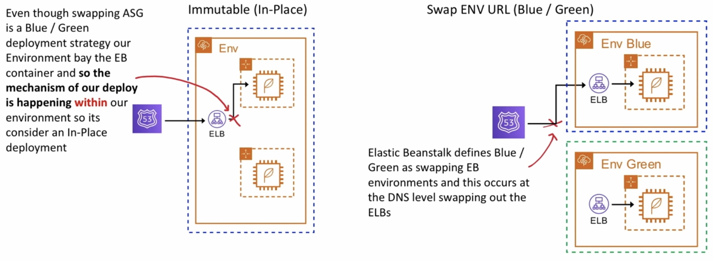

# AWS Elastic Beanstalk (EB)

[Lesson link](https://youtu.be/RrKRN9zRBWs?t=1183)\
Quickly deploy and manage web-apps on AWS.\
Heroku of AWS.

## Notes

EB is powered by CloudFormation template that setups for you:

- Elastic load balancer
- Autoscaling groups
- Relational Database Service (RDS)
- EC2 Instance pre-configured or custom platforms (Docker, Node.js, Python, etc.)
- Monitoring(CloudWatch, SNS)
- In-place and Blue/Green deployment methodologies
- Security(Rotates passwords)
- Can run Dockerized environments

### Web vs Worker environment

- **Web**
  - Single-Instance Env
    - Still uses ASG but desired capacity set to 1 to ensure server is always running.
    - Public IP Address has to be used to route traffic to server.
  - Load balanced Env
    - Uses ASG and set to scale
    - Uses ELB
    - Designed to scale.

- **Worker**
  - Creates an ASG
  - Creates a SQS Queue
  - Installs the SQSd daemon on the EC2 instances
  - Creates CloudWatch Alarm to dynamically scale instances based on health

### Deployment Policies

- **All at once**
Fastest but most dangerous method, if fail to deploy, you need to roll back changes by re-deploying the original version again to all instances.
    1. Deploy new app versions to all instances at the same time
    2. Takes all instances out of service while the deployment process
    3. Servers become available again
- **Rolling**
  Reduces capacity in batches.
    1. Deploy new app version to batch of instance at a time.
    2. Take batch's instance out of service while the deployment processes.
    3. Reattaches updates instances.
    4. Goes to next batch, taking them out of service.
    5. Reattach batch.

- **Rolling with additional batch**
  Will ensure capacity is never reduced.
    1. Launch new instance that will be used to replace a batch.
    2. Deploy update app version to new batch
    3. Attach the new batch and terminate the existing batch.
- **Immutable**
  Safest way to deploy for critical applications, because the old instances doesn't get deleted right away. This method is considered in-place under the scope of EB, since the new instance is still defined within the EB environment.
    1. Create a new ASG with EC2 instances.
    2. Deploy the updated version of the app on the new EC2 instances.
    3. Point the ELB to the new ASG and delete the ASG which will terminate the old EC2 instances.
- **Blue/ Green**
  DNS changes takes time to propagate to the world.
  Requires your database be outside of EB env, since env are terminated with loss of all their resources.

### In-place vs Blue/ Green deployment


  
### Deployment Methods in Web

| Deployment Policy               | Load Balanced Env  | Single Instance Env |
| ------------------------------- | ------------------ | ------------------- |
| All at once                     | :white_check_mark: | :white_check_mark:  |
| Rolling                         | :white_check_mark: |                     |
| Rolling with additional batches | :white_check_mark: |                     |
| Immutable                       | :white_check_mark: | :white_check_mark:  |

### Deployment Methods Reference Table

| Method                            | Impact of failed deployment                                                                | Deploy time                          | No downtime        | No DNS change      | Rollback process | Code deployed to Instances |
| --------------------------------- | ------------------------------------------------------------------------------------------ | ------------------------------------ | ------------------ | ------------------ | ---------------- | -------------------------- |
| **All at once**                   | Downtime                                                                                   | :clock10:                            |                    | :white_check_mark: | Manual           | Existing                   |
| **Rolling**                       | Single batch out of service, any successful batches before failure running new app version | :clock10: :clock10:                  | :white_check_mark: | :white_check_mark: | Manual           | Existing                   |
| **Rolling with additional batch** | Minimal if first batch fails; otherwise, similar to **Rolling**                            | :clock10::clock10::clock10:          | :white_check_mark: | :white_check_mark: | Manual           | New and Existing           |
| **Immutable**                     | Minimal                                                                                    | :clock10::clock10::clock10::clock10: | :white_check_mark: | :white_check_mark: | Terminate New    | New                        |
| **Blue/Green**                    | Minimal                                                                                    | :clock10::clock10::clock10::clock10: | :white_check_mark: |                    | Swap URL         | New                        |

### Configuration Files

EB environment can be customized using configuration files:

- `.ebextensions` is a hidden folder at the root of your project which contains the config files
- `.config` is the extension for the config files stored in `.ebextensions`
- config files can config:
  1. Option settings
  2. Linux/ Window server configuration
  3. Custom resources
- `env.yml` is the environment manifest stored at root of project
  - When creating new EB environments this file allow you to configure the defaults:
    1. The name of the env
    2. Choosing stack solution: Ruby, Node, python, etc.
    3. Associating the environment links
    4. Default configuration services: LoadBalancer, etc.

### Linux server configuration

- **Packages**
  - Download and install pre-packaged application and components
- **Groups**
  - Create Linux/UNIX groups to assign group IDs
- **Users**
  - Create Linux/UNIX users
- **Files**
  - Create files on the EC2 instance (inline or from URL)
- **Commands**
  - Execute commands on the EC2 instance before app is setup
- **Services**
  - Define which services should be started or stopped when the instance is launched
- **Container commands**
  - Execute commands that affect your application source code.
  
### EB CLI

Get CLI from Github

``` unix
git clone https://github.com/aws-elastic-beanstalk-cli-setup.git
./aws-elastic-beanstalk-cli-setup/scripts/bundled_installer
```

#### EB commands

| Command      | Info                                                                                                   |
| ------------ | ------------------------------------------------------------------------------------------------------ |
| eb init      | configure your project directory and EB CLI                                                            |
| eb create    | create your env                                                                                        |
| eb status    | see current status of your env                                                                         |
| eb health    | view health info about the instances and state of your overall env (use --refresh to update every 10s) |
| eb events    | see a list of events output by EB                                                                      |
| eb logs      | pull logs from an instance in your env                                                                 |
| eb open      | open your env's website in a browser                                                                   |
| eb deploy    | once the env is running, deploy an update                                                              |
| eb config    | take a look at the config options available for your running env                                       |
| eb terminate | delete the env                                                                                         |

### Custom Image

When you create an EB env, you can specify an Amazon Machine Images (AMI) to use instead of the standard EB AMI.
