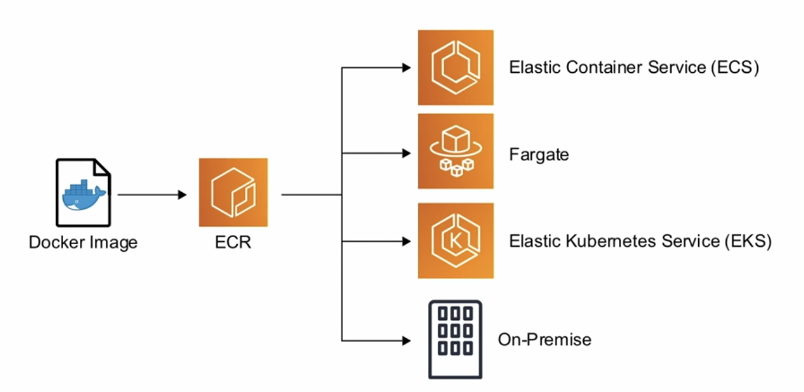

[Lesson link]("https://youtu.be/RrKRN9zRBWs?t=8502")
## AWS Elastic Container Registry (ECR)
A fully-managed Docker container registry that makes it easy for developers to store, manage, and deploy Docker container images.

## Notes
