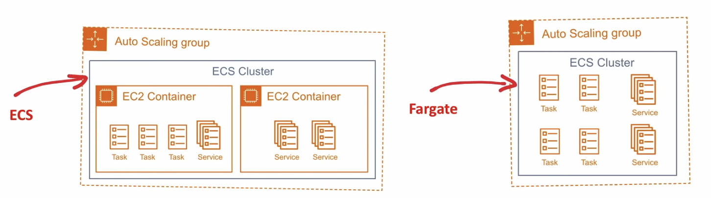

# AWS Elastic Container Service (ECS)

[Lesson link](https://youtu.be/RrKRN9zRBWs?t=8234)
Fully-managed container orchestration service. Highly secure, reliable, and scalable way to run containers.\

## Notes

Components of ECS

- **Cluster**
Multiple EC2 (Elastic Computing Cloud) instances which will house the docker containers.
- **Task Definition**
A JSON file that defines the configuration of (up to 10) containers you want to run.
- **Task**
Launches containers defined in Task definition.\
Tasks do not remain running  once workload is complete.
- **Service**
Ensures tasks remain running
- **Container Agent**
Binary on each EC2 instance which monitors, start and stops tasks.

### Creating cluster

- use spot or demand (spot for saving money)
  - spot instances are unused EC2 instance that is available for less than the on-demand prices, but can be interrupted. Spot instances are suitable for data analysis, batch jobs, background processing, and optional tasks.
- EC2 instance type
- Number of instances
- EBS Storage volume
- EC2 can be Amazon Linux 1 or Amazon Linux 2
- Choose a VPC or create new VPC (Virtual Private Cloud)
- Assign IAM role
- Option to turn on CloudWatch container insights
- Choose SSH key pair (Not recommended)

### Creating an ECS Service

1. Create IAM role for ECS instances:
   - IAM > CREATE ROLE > select EC2 > Attach `AmazonEC2ContainerServiceforEC2Role` policy > Add role name
2. ECS Create cluster
   - ECS > Clusters > Create Cluster > Choose EC2 Linux + Networking > Select instance type > Create
3. Create Task definition
   - Task definition > EC2 > Define name > Define task size, according to instance capabilities > Add container >  Define name > Insert image repo URI > Set memory limit > Port mappings, Host port: 80, Container port: 8080 > set environment variables: PORT: 8080, NODE_ENV: production
4. Create service
   - Services > Create > Launch type: EC2 > Service name > Number of tasks > Create

### ECS Fargate

Serverless containers. Run containers and pay based on duration and consumption.

- You can create an empty ECS cluster (no EC2's provisioned) and then launch Tasks as Fargate
- Yon don't need to provision, configure, and scale clusters of EC2 instances to run containers
- You are charged for at least one minute and after by the second.
- Pay based on duration and consumption.

#### Configure Fargate Tasks

- Define memory and vCPU for Fargate Task Definition.
- Add your containers and allocate the memory and vCPU required for each.
- When you run the Task you can choose what VPC and subnet it will run on.
- You can apply a Security Group to a Task.
- You can apply an IAM role to the Task.

#### Fargate VS Lambda

|             | Fargate                                        | Lambda                                               |
| ----------- | ---------------------------------------------- | ---------------------------------------------------- |
| Cold Starts | :white_check_mark: (Shorter)                   | :white_check_mark:                                   |
| Duration    | no limit                                       | 15 mins (max)                                        |
| Memory      | 30GB (max)                                     | 3GB (max)                                            |
| Containers  | you provide your own                           | limited to standardized containers                   |
| Integration | More manual labor                              | Seamlessly integrates with other serverless services |
| Pricing     | Pay at least 1 min and every additional second | Pay per 100ms                                        |

#### Creating a Fargate service

1. Create cluster > Networking only / Fargate > Name cluster > Create cluster
2. Create Task definition > Fargate > Task memory > Task vCPU > Add container > Container name > Container image > Memory limits > Port mappings > Environment variables > Create
3. Create Service > Fargate > Choose Task Definition > Service name > Number of tasks > Next > Choose VPC > Choose subnet (first one) > Create
4. Expose port: Service > Security groups > Inbound rules > Edit rule > Save
5. Go to app from Tasks > Public ip
