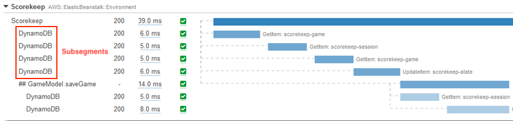
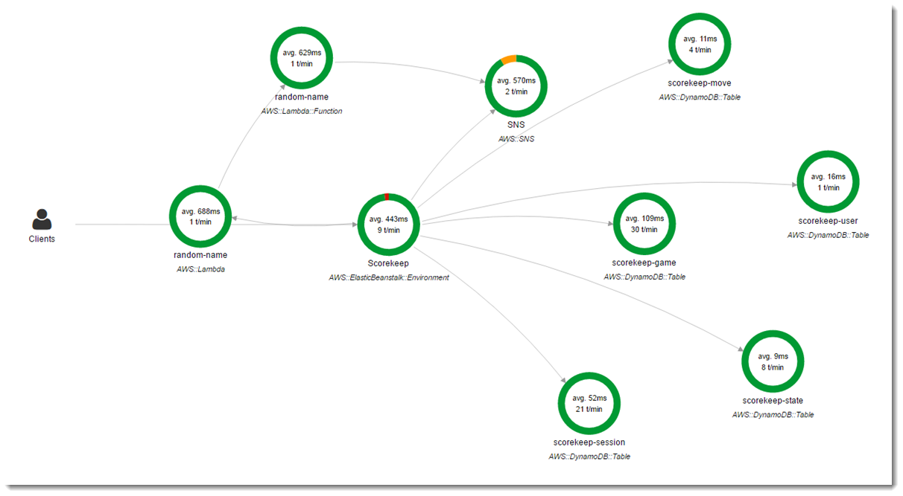

# AWS X-Ray

[Lesson link](https://youtu.be/RrKRN9zRBWs?t=10522)
Help developers analyze and debug applications utilizing micro-service architecture. It is a distributed tracing / performance monitoring system.

- **Micro-services**:
  - Micro-services is an architectural and organizational approach to software development where software is composed of small independent services that communicate over well-defined APIs.
  - Micro-service architectures make applications easier to scale and faster to develop, enabling innovation and accelerating time-to-market for new features.
  - Ex: Serverless storage, container tasks, databases, notifications, queueing, streaming, serverless functions.
- **Distributed Tracing**
  - Also called distributed request tracing, is a method used to profile and monitor apps, especially those built using a micro-service architecture. Distributing tracing helps pinpoint failures occur and what causes poor performance.
- **Performance Monitoring**
  - Monitoring and management of performance and availability of software apps. APM strives to detect and diagnose complex application performance problems to maintain an expected level of service.
- **Similar third-part service to X-ray**
  - Datadog, New Relic, SignalFx, lumigo
- **X-Ray is a Distributed Tracing system**
  - Collects data about requests that your application serves
  - View, filter collected data to identify issues and avenues for optimization.
  - For any traced request to your application, you can see detailed information not only about the request and response, but also about calls that your application makes to downstream AWS resources, micro-services, databases and HTTP web APIs.

## The anatomy of X-Ray

|              |       |                  |       |               |
| :----------: | :---: | :--------------: | :---: | :-----------: |
| X-Ray Daemon |   ➡️   |    X-Ray API     |   ➡️   | X-Ray Console |
|      ⬆️       |  ↘️↖️   |        ↕️         |       |               |
|  X-Ray SDK   |       | AWS SDK/ AWS CLI |       |               |

- The X-Ray SDK provides:
  - Interceptors to add to your code to trace incoming HTTP requests
  - Client handlers to instrument AWS SDK clients that your application uses to call other AWS services
  - An HTTP Client to instrument calls to other internal and external HTTP web services.

## Instrumentation

- Instrumenting is the ability to monitor or measure the level of a product's performance, to diagnose errors, and to write trace information.
- Ex:
  
  ``` javascript
    var app  = express();
    var AWSXRay = require("aws-xray-sdk")

    # Start tracing 
    app.use(AWSXRay.express.openSegment("MyApp"));

    app.get("/", function(req, res) {
        res.render("index");
    });

    # End tracing
    app.use(AWSXRay.express.closeSegment());
  ```

## X-Ray Daemon

- Instead of sending trace data directly to X-Ray, the SDK sends JSON segment documents to a daemon process listening to UDP traffic.
- The X-Ray Daemon buffers segments in a queue and uploads them to X-Ray in batches.
- The daemon is available for Linux, Windows, Mac, and included on EB and Lambda platforms.
- X-Ray uses trace data from the AWS resources that power your cloud applications to generate a detailed service graph.

## X-Ray Concepts

- X-Ray receives data from services as segments.
- X-Ray groups segments that have a common request into traces.
- X-Ray processes the traces to generate a service graph that provides a visual representation of your app.
  - **Segments**
    - The compute resources running your application logic sends data about their work as segments.
    - A segment can send the following information:
      - **The host**: hostname, alias or IP address
      - **The request**: method, client, address, path, user agent
      - **The response**: status, content
      - **The work done**: start and end times, subsegments
      - **Issues that occur**: errors, faults and exceptions, including automatic capture of exception stacks.
  - **Subsegments**
    - Subsegments provide more granular timing information and details about downstream calls that your app made to fulfill the original request.
    - A subsegment can contain additional details about a call to an AWS service, an external HTTP API, or an SQL database.
    - 
  - **Service Graph**
    - Shows client, front-end services, and back-end services
    - Use the service graph to improve performance by identifying bottlenecks, latency spikes, and etc.
    
  - Traces
  - Sampling
  - Tracing header
  - Filter expressions
  - Groups
  - Annotations and Metadata
  - Errors, Faults, and Exceptions